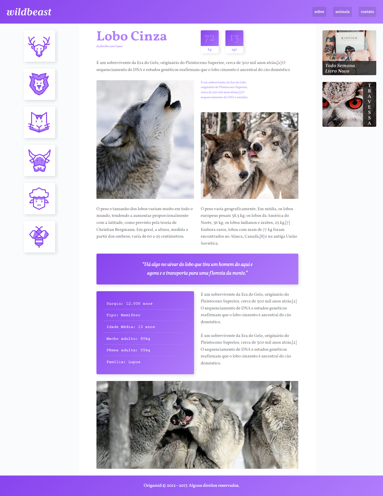

	<h1></h1>

Neste projeto aprendi utilizar o Grid layout na criação de um site responsivo, utilizando as propriedades no CSS e mantendo o HTML limpo, de fácil entendimento e manutenção.

Além do CSS Grid, abordei também a propriedade Flexbox e metodologias que auxiliam na arquitetura do CSS, sendo a Metodologia BEM o principal método abordado.

Para visualização final, entre em: <a href="https://fernandnsp.github.io/Estudo-CSS_Grid/">Wildbeast - Fernanda Sene</a>

 

 

	

